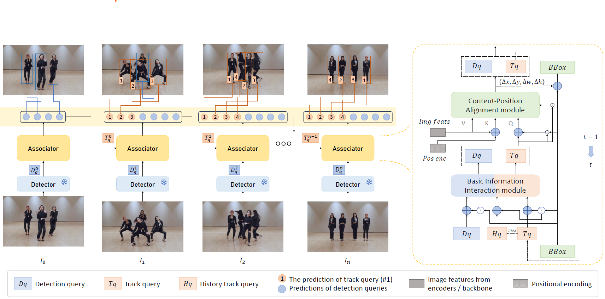

# TBDQ-Net

# Framework Overview

*Figure 1: Overview of TBDQ-Net.*

TBDQ-Net achieves end-to-end multi-object tracking in a decoupled framework, acquiring strong association capabilities with higher efficiency during both training and inference processes.

---

# Demos

### Demonstration 1: [DanceTrack]

### Demonstration 2: [SportsMOT]

### Demonstration 3: [MOT20]

---

The code is scheduled to be open-sourced.

